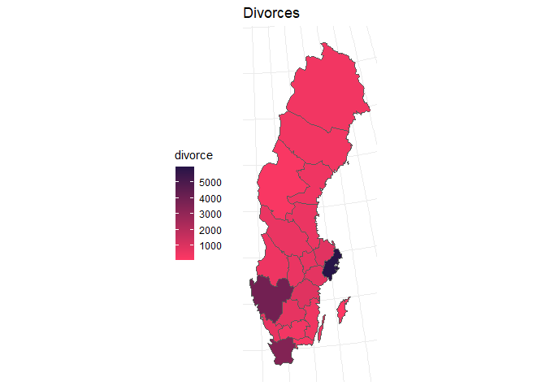
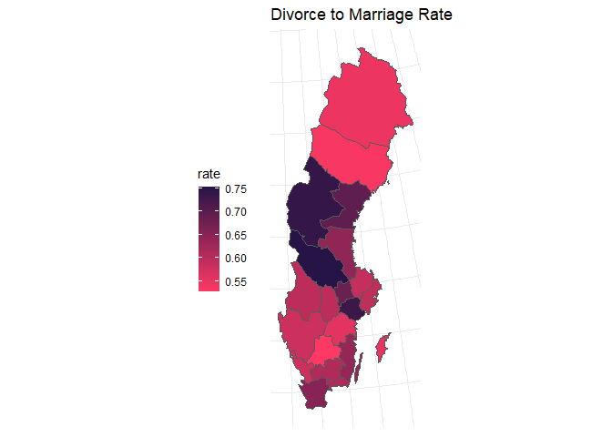

Sweden Marriages and Divorces
================
2022-08-22

## Three Levels of Analysis of Sweden’s Marriages and Divorces

The goal of this analysis is to summarize , analyze , and identify
trends in Marriages and Divorces in Sweden from 2000 - 2020

I’ll First Start from the Total Divorces and Marriages in all of Sweden
,and then move to NUTS-2 .

### For Marriages and Divroces in Sweden (2000 - 2021)

``` r
head(Total)
```

    ##   Year divorce marriage Divorace_rate
    ## 1 2000   22082    43138     0.5118921
    ## 2 2001   21527    39157     0.5497612
    ## 3 2002   21861    41523     0.5264793
    ## 4 2003   21818    42693     0.5110440
    ## 5 2004   20808    47053     0.4422247
    ## 6 2005   20747    48215     0.4303018

``` r
summary(Total)
```

    ##       Year         divorce         marriage     Divorace_rate   
    ##  Min.   :2000   Min.   :20747   Min.   :37591   Min.   :0.4000  
    ##  1st Qu.:2005   1st Qu.:21829   1st Qu.:44117   1st Qu.:0.4428  
    ##  Median :2010   Median :23929   Median :51203   Median :0.4725  
    ##  Mean   :2010   Mean   :23598   Mean   :49159   Mean   :0.4863  
    ##  3rd Qu.:2016   3rd Qu.:24993   3rd Qu.:53408   3rd Qu.:0.5194  
    ##  Max.   :2021   Max.   :26933   Max.   :56555   Max.   :0.6815

``` r
plot1
```

<!-- -->

### In 2021 there were 38895 Marriages and 23467 Divorces

## Now for the NUTS-2 :

### For Marriages we have :

``` r
Marriages2
```

    ## # A tibble: 176 × 4
    ##    Region          year marriage code 
    ##    <chr>          <dbl>    <dbl> <chr>
    ##  1 SE11 Stockholm  2000    11542 SE11 
    ##  2 SE11 Stockholm  2001    10850 SE11 
    ##  3 SE11 Stockholm  2002    11451 SE11 
    ##  4 SE11 Stockholm  2003    11588 SE11 
    ##  5 SE11 Stockholm  2004    12711 SE11 
    ##  6 SE11 Stockholm  2005    12741 SE11 
    ##  7 SE11 Stockholm  2006    13314 SE11 
    ##  8 SE11 Stockholm  2007    14517 SE11 
    ##  9 SE11 Stockholm  2008    14887 SE11 
    ## 10 SE11 Stockholm  2009    14952 SE11 
    ## # … with 166 more rows
    ## # ℹ Use `print(n = ...)` to see more rows

``` r
summary(Marriages2)
```

    ##     Region               year         marriage         code          
    ##  Length:176         Min.   :2000   Min.   : 1092   Length:176        
    ##  Class :character   1st Qu.:2005   1st Qu.: 2728   Class :character  
    ##  Mode  :character   Median :2010   Median : 4917   Mode  :character  
    ##                     Mean   :2010   Mean   : 6145                     
    ##                     3rd Qu.:2016   3rd Qu.: 8617                     
    ##                     Max.   :2021   Max.   :15949

``` r
plot2marriage
```

<!-- -->

### For Divorces we Have :

``` r
Divorces2
```

    ## # A tibble: 176 × 4
    ##    Region          year divorce code 
    ##    <chr>          <dbl>   <dbl> <chr>
    ##  1 SE11 Stockholm  2000    5540 SE11 
    ##  2 SE11 Stockholm  2001    5361 SE11 
    ##  3 SE11 Stockholm  2002    5361 SE11 
    ##  4 SE11 Stockholm  2003    5291 SE11 
    ##  5 SE11 Stockholm  2004    5355 SE11 
    ##  6 SE11 Stockholm  2005    5221 SE11 
    ##  7 SE11 Stockholm  2006    5611 SE11 
    ##  8 SE11 Stockholm  2007    5749 SE11 
    ##  9 SE11 Stockholm  2008    6025 SE11 
    ## 10 SE11 Stockholm  2009    6271 SE11 
    ## # … with 166 more rows
    ## # ℹ Use `print(n = ...)` to see more rows

``` r
summary(Divorces2)
```

    ##     Region               year         divorce         code          
    ##  Length:176         Min.   :2000   Min.   : 656   Length:176        
    ##  Class :character   1st Qu.:2005   1st Qu.:1384   Class :character  
    ##  Mode  :character   Median :2010   Median :2616   Mode  :character  
    ##                     Mean   :2010   Mean   :2950                     
    ##                     3rd Qu.:2016   3rd Qu.:4318                     
    ##                     Max.   :2021   Max.   :7495

``` r
plot2divorce
```

<!-- -->

## Now we’ll plot our data Regionally :

### For Regional Marriage we have :

``` r
Marriages2_2021
```

    ## # A tibble: 8 × 3
    ##   Region                     year marriage
    ##   <chr>                     <dbl>    <dbl>
    ## 1 SE11 Stockholm             2021    10065
    ## 2 SE12 East-Central Sweden   2021     6390
    ## 3 SE21 Småland and islands   2021     3114
    ## 4 SE22 South Sweden          2021     5861
    ## 5 SE23 West Sweden           2021     8002
    ## 6 SE31 North-Central Sweden  2021     2728
    ## 7 SE32 Central Norrland      2021     1092
    ## 8 SE33 Upper Norrland        2021     1643

``` r
marriage_map_plot_2021
```

<!-- -->

``` r
Divorces2_2021
```

    ## # A tibble: 8 × 3
    ##   Region                     year divorce
    ##   <chr>                     <dbl>   <dbl>
    ## 1 SE11 Stockholm             2021    5965
    ## 2 SE12 East-Central Sweden   2021    3970
    ## 3 SE21 Småland and islands   2021    1795
    ## 4 SE22 South Sweden          2021    3801
    ## 5 SE23 West Sweden           2021    4648
    ## 6 SE31 North-Central Sweden  2021    1805
    ## 7 SE32 Central Norrland      2021     775
    ## 8 SE33 Upper Norrland        2021     888

``` r
divorce_map_plot_2021
```

<!-- -->

## Now For NUTS-3 :

### For Marriages :

``` r
Marriages_NUTS_3_cleaned
```

    ## # A tibble: 462 × 3
    ##    Region                  year marriage
    ##    <chr>                  <dbl>    <dbl>
    ##  1 SE110 Stockholm county  2000    11542
    ##  2 SE110 Stockholm county  2001    10850
    ##  3 SE110 Stockholm county  2002    11451
    ##  4 SE110 Stockholm county  2003    11588
    ##  5 SE110 Stockholm county  2004    12711
    ##  6 SE110 Stockholm county  2005    12741
    ##  7 SE110 Stockholm county  2006    13314
    ##  8 SE110 Stockholm county  2007    14517
    ##  9 SE110 Stockholm county  2008    14887
    ## 10 SE110 Stockholm county  2009    14952
    ## # … with 452 more rows
    ## # ℹ Use `print(n = ...)` to see more rows

``` r
Marriage_nuts3_plot
```

<!-- -->

### For Divorces :

``` r
Divorces_NUTS_3_cleaned
```

    ## # A tibble: 462 × 3
    ##    Region                  year divorce
    ##    <chr>                  <dbl>   <dbl>
    ##  1 SE110 Stockholm county  2000    5540
    ##  2 SE110 Stockholm county  2001    5361
    ##  3 SE110 Stockholm county  2002    5361
    ##  4 SE110 Stockholm county  2003    5291
    ##  5 SE110 Stockholm county  2004    5355
    ##  6 SE110 Stockholm county  2005    5221
    ##  7 SE110 Stockholm county  2006    5611
    ##  8 SE110 Stockholm county  2007    5749
    ##  9 SE110 Stockholm county  2008    6025
    ## 10 SE110 Stockholm county  2009    6271
    ## # … with 452 more rows
    ## # ℹ Use `print(n = ...)` to see more rows

``` r
Divorces_NUTS_3_plot
```

<!-- -->

## That’s intersting

### Now lets figure out the ratio of the divorces in marriages

``` r
Total
```

    ##    Year divorce marriage Divorace_rate
    ## 1  2000   22082    43138     0.5118921
    ## 2  2001   21527    39157     0.5497612
    ## 3  2002   21861    41523     0.5264793
    ## 4  2003   21818    42693     0.5110440
    ## 5  2004   20808    47053     0.4422247
    ## 6  2005   20747    48215     0.4303018
    ## 7  2006   21285    50501     0.4214768
    ## 8  2007   21813    53506     0.4076739
    ## 9  2008   22580    56445     0.4000354
    ## 10 2009   23534    54349     0.4330162
    ## 11 2010   25151    56555     0.4447175
    ## 12 2011   24884    53012     0.4694032
    ## 13 2012   25005    56240     0.4446124
    ## 14 2013   26933    51610     0.5218562
    ## 15 2014   26143    53113     0.4922147
    ## 16 2015   24876    52314     0.4755132
    ## 17 2016   24258    53817     0.4507498
    ## 18 2017   24210    52497     0.4611692
    ## 19 2018   24958    50796     0.4913379
    ## 20 2019   25407    48481     0.5240610
    ## 21 2020   25619    37591     0.6815195
    ## 22 2021   23647    38895     0.6079702

``` r
total_ratio
```

<!-- -->

## In Sweden the Divorce rate is 60 % (2021) !!

# What about the Divorace rate in Region ?

## In NUTS-2 :

### Divorce rate :

``` r
Divorce_rate_NUTS2_plot
```

<!-- -->

## In NUTS-3 :

### Divorce Rate :

``` r
Divorce_rate_NUTS3
```

<!-- -->

## Data Source : Sweden Statistics

## Analysis by : Mohamad Nasher
